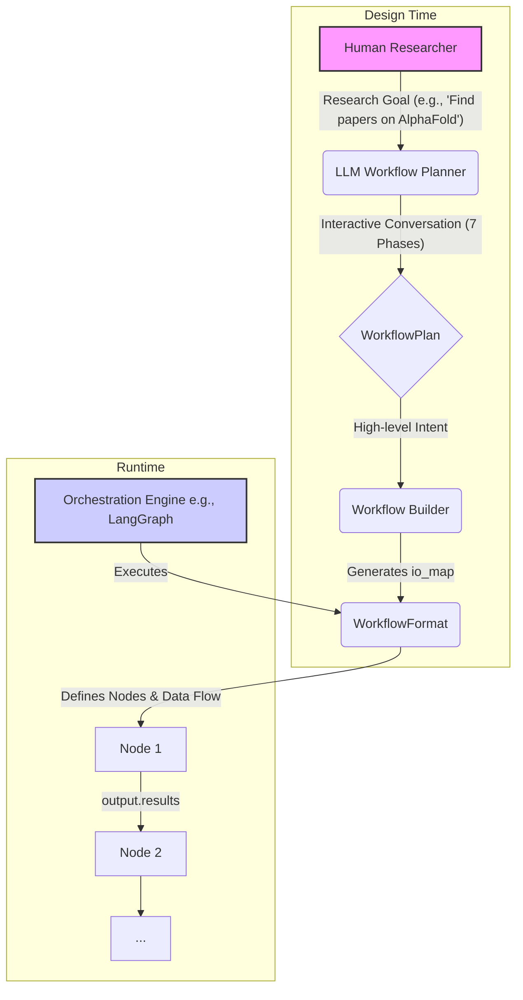
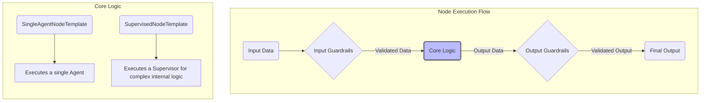

# Accelerated Discovery Framework: Codebase Overview

This document provides a comprehensive overview of the Accelerated Discovery (AKD) framework's architecture, core components, and design philosophy.

## 1. Core Philosophy

The AKD framework is a **human-centric Multi-Agent System (MAS)** for scientific discovery. Its primary goal is to augment and empower human researchers, not to replace them. The core principles are:

- **Human-in-the-Loop Control:** The researcher directs the discovery process, with final say on workflow, parameters, and interpretation.
- **Scientific Integrity:** The framework enforces deep attribution, surfaces conflicting evidence, and validates sources to ensure research quality.
- **Transparency & Reproducibility:** Every research workflow is a shareable, inspectable, and repeatable artifact.
- **Open Collaboration:** The framework is designed to be a community-driven platform for shared scientific advancement.

## 2. High-Level Architecture

The system uses a **Planner-Orchestrator** pattern. A natural language research goal is transformed into a structured, executable workflow through an interactive planning process. This workflow is then run by an orchestration engine (like LangGraph).



### Components:

1.  **LLM Workflow Planner:** An interactive, conversational LLM agent that guides the user from a high-level goal to a concrete plan.
2.  **WorkflowPlan:** A Pydantic model representing the high-level research plan, including suggested agents and steps.
3.  **Workflow Builder:** A component that transforms the `WorkflowPlan` into an executable `WorkflowFormat`. Its key responsibility is creating the `io_map` for data flow.
4.  **WorkflowFormat:** A JSON-serializable, executable specification of the workflow, defining the nodes (agents) and the data flow between them.
5.  **Orchestration Engine:** A runtime engine (like LangGraph) that executes the `WorkflowFormat`, managing the state and execution of each node.

## 3. The `NodeTemplate` Architecture

The `NodeTemplate` is the fundamental building block of the AKD framework. Every functional component in a workflow (agent, tool, logical step) **must** be an implementation of `AbstractNodeTemplate`. This ensures standardization, reusability, and framework-agnosticism.

### Anatomy of a Node

A node is a self-contained unit with a clearly defined structure.



### Key Implementations:

-   **`AbstractNodeTemplate` (`akd/nodes/templates.py`):** The abstract base class defining the execution lifecycle:
    1.  Run Input Guardrails.
    2.  Execute core logic (`_execute` method).
    3.  Run Output Guardrails.
    4.  Update global state.

-   **`SingleAgentNodeTemplate` (`akd/nodes/templates.py`):** The most common node type, designed to wrap a single `BaseAgent`.
    -   It automatically binds to the agent's input/output schemas.
    -   It implements the crucial runtime data flow mechanism via its `io_map` and `_resolve_inputs` method.

-   **`SupervisedNodeTemplate` (`akd/nodes/templates.py`):** A node that uses a `Supervisor` agent for more complex internal orchestration, potentially managing multiple tools or steps within a single node.

## 4. Runtime Data Flow: `io_map` and JSONPath

The `WorkflowFormat` defines *what* nodes to run. The `io_map` within each node definition specifies *how* data flows between them. This is implemented in the `SingleAgentNodeTemplate`.

When a `SingleAgentNodeTemplate` executes, it resolves its required inputs using the `_resolve_inputs` method, which leverages the `io_map`.

**Example:** Imagine `node_B` needs an input called `documents`, which is the output of `node_A`'s `results` field.

The `WorkflowFormat` would look like this:

```json
{
  "nodes": [
    { "type": "node_A", "id": "node_A_1" /* ... */ },
    {
      "type": "node_B",
      "id": "node_B_1",
      "io_map": {
        "documents": "$.node_A_1.outputs.results"
      }
    }
  ]
}
```

### Data Flow Diagram:

```mermaid
graph TD
    subgraph "Orchestrator Runtime"
        A(Global State) -- "Contains all node states" --> B(SingleAgentNodeTemplate for node_B);

        subgraph "node_B Execution"
            B -- 1. "Calls _resolve_inputs()" --> C{Build JSONPath Context};
            C -- 2. "Creates a view of Global State" --> D(Apply io_map);
            D -- 3. "Finds '$.node_A_1.outputs.results'" --> E{Resolved Inputs};
            E -- 4. "Validated inputs" --> F(Agent Execution);
            F -- 5. "Agent Output" --> G(Update Node State);
        end

        G -- 6. "Mutates Global State" --> A;
    end
```

1.  **Context Building:** The node creates a JSON context of the entire `GlobalState`, making all other nodes' inputs and outputs accessible.
2.  **`io_map` Application:** It iterates through its `io_map`, using the JSONPath expressions to find and retrieve data from the context.
3.  **Input Resolution:** The retrieved data is used to populate the inputs required by the node's agent.
4.  **Execution:** The agent is run with the resolved inputs.
5.  **State Update:** The node's output is written back to the `GlobalState`, making it available for subsequent nodes.

## 5. Project Directory Structure

-   `akd/`: The core framework source code.
    -   `agents/`: Implementations of specialized agents (e.g., `DeepSearchAgent`, `GapAnalysisAgent`).
    -   `nodes/`: The `NodeTemplate` implementations and state management (`GlobalState`, `NodeState`).
    -   `planner/`: The LLM-based workflow planner, builder, and associated structures.
    -   `tools/`: The building blocks used by agents (e.g., scrapers, resolvers, search tools).
    -   `configs/`: Project-wide configurations and prompts.
    -   `mapping/`: Definitions for field mappings between agents.
-   `scripts/`: Standalone scripts for demos and utilities (e.g., `demo_planner.py`).
-   `tests/`: The comprehensive test suite for the framework.
-   `docs/`: Project documentation, including the design philosophy.
-   `examples/`: Practical examples of how to use different framework components.
-   `notebooks/`: Jupyter notebooks for interactive exploration and examples.
-   `config/`: Example configuration files for agents.
-   `pyproject.toml`: Project metadata and dependencies.

This overview provides a foundational understanding of the Accelerated Discovery framework. For deeper dives, refer to the `README.md` files within each module and the source code itself.
