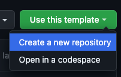
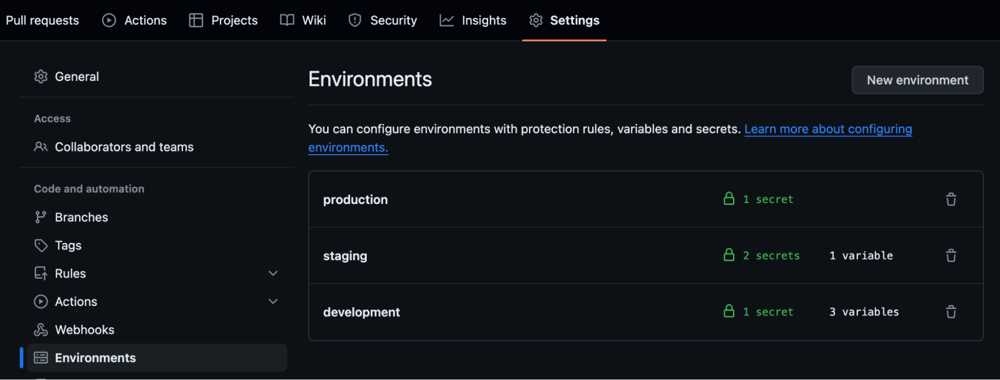

**Usage Guide for the UAH IMPACT Repository Template**

The repository-template repository serves as a baseline for establishing a new repository for projects at IMPACT. It employs Gitflow principles, infrastructure as code via AWS CDK, short lived credentials using AWS IAM Identity Center and OIDC, rule enforcement through CloudFormation Guard, and a CI/CD pipeline with GitHub Actions. The goal with this repository is to standardize deployments across IMPACT making it easier to onboard new members to a project, review project documentation, and trace AWS resources. 

AWS restrictions and policies are as follows: All resources must be tagged with a “project” tag with the name of the project and “contact” with the email of someone who can be reached with questions about the resource. Beyond this there are no additional restrictions aside from those added by the separate permission sets outlined in the ‘UAH IMPACT Roles’

**The CICD (Continuous Integration / Continuous Deployment) Pipeline**

This template includes a cicd.yml file in the .github/workflows folder that servers as the means for deploying infrastructure required for NASA-IMPACT projects. It is designed to take advantage of AWS's CDK and CloudFormation. As part of this workflow several steps take place. See below for an explanation of each.

**Gitflow enforcer:**

This enforces Gitflow principles which is a branching model that involves the use of feature branches and multiple primary branches. For more information on Gitflow see this.

**Set environment:**

This sets the environment based on the current branch and is used throughout the action. Make sure that you have your environment variables and secrets populated properly.

**CFN validation:**

This step checks your CloudFormation template to make sure that the resources created by your CDK stack are in compliance with IMPACT rules. This is accomplished using CloudFormation Guard and a centrally managed rules file. If you would like to independently test your CloudFormation template please view “Checking CloudFormation templates locally” below.. This step is designed to catch any incompliant resources before they are deployed in the UAH AWS environment. Skipping this step with non-compliant resources will still trigger the service control and tagging policies in the UAH environment.

Currently the requirements are very simple: Tag all resources with a “project” tag with the name of the project and “contact” with the email of someone who can be reached with questions about the resource. This can be managed by tagging the resources individually in CDK or more easily by using Tags.of in the app.py file as shown below. This will tag all resources created by the stack with the tags you define. 

**Deploy:**

This step takes the validated CDK stack/CloudFormation template, assumes the appropriate role based on the current branch/environment, and deploys the stack to AWS.

**File Structure**

This repository template contains the following files:

* A .github/workflows folder
    * This contains the CICD workflow file that is outline below in “The CICD (Continuous Integration / Continuous Deployment) Pipeline”
* A README with a summarized version of this guide
* A requirements.txt file with the minimum required packages for the CICD pipeline to work properly.

In using this template you are free to add as many files and folders as are necessary for your project. As this template is built around the use of CDK you will need to create a folder for your CDK application and its files which is explained below under “Preparing your CDK Stack.”

**Creating a repository from this template**

* Above the file list, click Use this template and select Create a new repository.

* From the Owner drop-down menu select NASA-IMPACT and give you repo a name

* (Note: Name the repo using the format project_team-application in lower case (eg. admg-backend))
* Ensure that Include all branches is selected to ensure all branches and directories are copied

* Click Create repository from template

**Setting the branch protection rules**

Branch protections will not automatically be copied from the template. Ensure that you enable the following settings for the staging and production branches by going to** Settings** at the top of the newly created repository, clicking **Branches **under** **“code and automation,” and then **Add branch protection rule.**

Make sure the following options are selected

* Add "*" to apply the protection rule to all branches in the repository.
* Require a pull request before merging
* Require approvals

* Do not allow bypassing the above settings

* Your branch protection rules screen should now look like this:

**Preparing your CDK Stack**

This repository is built around using AWS’s IAC solution, CDK (for those unfamiliar with CDK see AWS CDK Workshop: [https://cdkworkshop.com/](https://cdkworkshop.com/)). **Note that the UAH AWS Organization accounts are already bootstrapped and ready to work with CDK v2 so you will not need to perform that step.**

Once your branch protections are set up you can begin setting up the necessary directories for CDK. It is recommended that you make a separate directory for this and run “cdk init sample-app --language=&lt;cdk compatible language of choice>” 

**Populating the github environments**

All secrets and variables will be handled using github environment secrets and variables which are not copied from the template. These must be set up in the repository Settings by clicking **Environments** under "Code and automation". From here create a "production", "staging", and "development" environment to correspond with the three primary branches. Your environments page should look like the following:

At minimum the following secrets and variables are required:

* Secret 1: (In each environment)
    * DEPLOYMENT_ROLE_ARN
        * The arn of the role for the environment in the form arn:aws:iam::&lt;AWS_ACCOUNT_ID>:role/&lt;role_name>
        * Note: These roles have been standardized across the UAH IMPACT environments. See the “UAH IMPACT Roles” section for information about each
* Variable 1:
    * AWS_REGION
        * The region you wish to deploy your stack to in a form like “us-west-2”
* Variable 2:
    * CDK_WORKING_DIRECTORY
        * The path to your CDK directory containing the app.py file
* Variable 3:
    * PATH_TO_CFN_TEMPLATE
        * The path to your CDK template .json file

Outside of these required secrets and variables you are free to store any additional secrets or variables required by your application.

Below are some examples of what items should be stored in secrets vs variables.

**Examples of items to store as github environment secrets:**

* AWS Account IDs
* AWS Role ARNs
* VPC IDs
* Cognito Secrets
* Security Group IDs
* Any Sensitive Data (If you aren't sure, store it as a secret)

**Examples of items to store as github environment variables:**

* File Paths
* Configuration Parameters
* Version Information
* URLs and Endpoints
* Feature Flags
* Any Non-Sensitive Data

**UAH IMPACT Roles**

The UAH IMPACT AWS Organizations have been pre-configured with the following roles:

* admin-oidc
    * This role has administrative rights and is intended to be used with the development branch and environment for testing purposes.
    * This is a very open role and should be used cautiously.
    * [https://docs.aws.amazon.com/aws-managed-policy/latest/reference/AdministratorAccess.html](https://docs.aws.amazon.com/aws-managed-policy/latest/reference/AdministratorAccess.html) 
* mcp-tenantDeveloper-oidc
    * This role mirrors the permissions boundaries of the MCP LOC 30 environment and is intended to be used with the staging branch and environment to test that the application can be deployed in the MCP LOC 30 environment.
    * See here for the current restrictions: [https://github.com/NASA-IMPACT/Lessons_Learned/blob/main/organization_policies_oidc_roles/organization_policies_oidc_roles/policies/mcp-tenantDeveloper.json](https://github.com/NASA-IMPACT/Lessons_Learned/blob/main/organization_policies_oidc_roles/organization_policies_oidc_roles/policies/mcp-tenantDeveloper.json) 
* mcp-tenantOperator-oidc
    * This role mirrors the permissions boundaries of the MCP LOC 40 environment which includes additional permissions from the LOC 30 environment and is intended to be used with the staging branch and environment to test that the application can be deployed in the MCP LOC 40 environment.
    * See here for the current restrictions: [https://github.com/NASA-IMPACT/Lessons_Learned/blob/main/organization_policies_oidc_roles/organization_policies_oidc_roles/policies/mcp_tenantOperator-APIG.json](https://github.com/NASA-IMPACT/Lessons_Learned/blob/main/organization_policies_oidc_roles/organization_policies_oidc_roles/policies/mcp_tenantOperator-APIG.json) 
* smce-ProjectAdmins-oidc
    * This role has Admin permissions that are only restricted by the permission sets in the SMCE environment and is intended to be used with the staging branch and environment to test that your application can be deployed in the SMCE environment.
    * The following 4 permission sets limit the permissions of the Admin role:
        * [https://github.com/NASA-IMPACT/Lessons_Learned/blob/main/organization_policies_oidc_roles/organization_policies_oidc_roles/policies/SMCE_Disable_Non-US_Regions.json](https://github.com/NASA-IMPACT/Lessons_Learned/blob/main/organization_policies_oidc_roles/organization_policies_oidc_roles/policies/SMCE_Disable_Non-US_Regions.json)
        * [https://github.com/NASA-IMPACT/Lessons_Learned/blob/main/organization_policies_oidc_roles/organization_policies_oidc_roles/policies/SMCE_MFA_ForceEnable.json](https://github.com/NASA-IMPACT/Lessons_Learned/blob/main/organization_policies_oidc_roles/organization_policies_oidc_roles/policies/SMCE_MFA_ForceEnable.json)
        * [https://github.com/NASA-IMPACT/Lessons_Learned/blob/main/organization_policies_oidc_roles/organization_policies_oidc_roles/policies/SMCE_PreserveRestrictions.json](https://github.com/NASA-IMPACT/Lessons_Learned/blob/main/organization_policies_oidc_roles/organization_policies_oidc_roles/policies/SMCE_PreserveRestrictions.json)
        * [https://github.com/NASA-IMPACT/Lessons_Learned/blob/main/organization_policies_oidc_roles/organization_policies_oidc_roles/policies/SMCE_Training_S3ReadAccess.json](https://github.com/NASA-IMPACT/Lessons_Learned/blob/main/organization_policies_oidc_roles/organization_policies_oidc_roles/policies/SMCE_Training_S3ReadAccess.json) 
* smce-ProjectPowerUsers-oidc
    * This role is similar to the pervious SMCE role but instead is granted PowerUser permissions that are then restricted by the same 4 permission sets as the smce Admin role above

**Checking CloudFormation templates locally**

It is recommended that while you develop your CDK stack/CloudFormation template that you run it against the UAH IMPACT environment rules to ensure that it is still in compliance. This can be done locally by doing the following:

* Download and install CloudFormation Guard following these instructions.
* Download the central rules file from here: https://github.com/NASA-IMPACT/Lessons_Learned/blob/main/cfn-guard/enforce-tags.guard.
* Synthesize your CDK stack using aws cdk synth
* Run the following command:
* cfn-guard validate \

--data &lt;path/to/your/template> \

--rules &lt;path/to/UAH/rules/file> \

--show-summary pass,fail \

--type CFNtemplate
