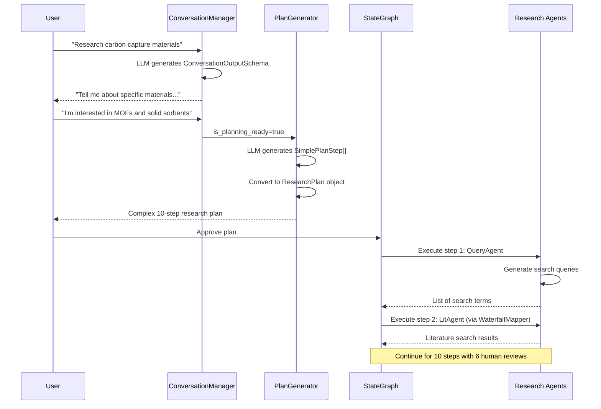

# Research Planner Technical Architecture

## System Components & Data Flow

```mermaid
graph TB
    %% External Interface
    subgraph UserLayer["🎯 User Interface Layer"]
        User[👤 User] 
        TestScript["🧪 Test Script<br/>Auto/Interactive Mode"]
    end
    
    %% API Layer
    subgraph APILayer["🚀 API Layer"]
        API[ResearchPlannerAPI]
        APIStart["start_research()"]
        APIStatus["get_workflow_status()"]
        APIContinue["continue_conversation()"]
        APIApprove["approve_plan()"]
        APIExecute["execute_research()"]
    end
    
    %% Core Orchestration
    subgraph OrchestrationLayer["🎪 Orchestration Layer"]
        Orchestrator[ResearchPlannerOrchestrator]
        PlanRes["plan_research()"]
        ContConv["continue_conversation()"]
        ProcAppr["process_approval()"]
        BuildGraph["build_research_state_graph()"]
    end
    
    %% Planning Components
    subgraph PlanningLayer["🧠 Planning Components"]
        ConvMgr["ConversationManager<br/>LangBaseAgent"]
        PlanGen["PlanGenerator<br/>LangBaseAgent"]
        Registry["AgentRegistry<br/>Dynamic Discovery"]
    end
    
    %% State Management
    subgraph StateLayer["🏛️ State Management"]
        GlobalState["GlobalWorkflowState<br/>• workflow_id<br/>• planner_state<br/>• research_artifacts<br/>• human_interactions"]
        PlannerState["PlannerState<br/>• research_goal<br/>• research_domain<br/>• current_plan"]
        ResearchPlan["ResearchPlan<br/>• plan_id<br/>• steps: Dict[str, PlanStep]<br/>• current_step_id<br/>• completed_steps"]
    end
    
    %% Execution Engine
    subgraph ExecutionLayer["⚡ Execution Engine"]
        ExecWorkflow[ResearchExecutionWorkflow]
        StateGraph[LangGraph StateGraph]
        InitNode[initialize_execution_node]
        ExecNode[execute_step_node]
        ReviewNode[human_review_node]
        CompleteNode[complete_execution_node]
    end
    
    %% Research Agents
    subgraph AgentLayer["🤖 Research Agents"]
        QueryAgent["QueryAgent<br/>✅ Factory Available"]
        LitAgent["LitAgent<br/>❌ No Factory"]
        ExtractAgent["EstimationExtractionAgent<br/>✅ Factory Available"]
        RelevancyAgent["MultiRubricRelevancyAgent<br/>✅ Factory Available"]
        IntentAgent["IntentAgent<br/>✅ Factory Available"]
        FollowUpAgent["FollowUpQueryAgent<br/>❌ No Factory"]
        BasicRelevancy["RelevancyAgent<br/>❌ No Factory"]
    end
    
    %% LLM Integration
    subgraph LLMLayer["🧠 LLM Integration"]
        OpenAI[OpenAI GPT-4o-mini]
        FunctionCalling["Function Calling<br/>Structured Output"]
        ConvSchema[ConversationOutputSchema]
        PlanSchema["SimplePlanStep[]<br/>→ ResearchPlan"]
    end
    
    %% Data Transformation
    subgraph DataLayer["🌊 Data Flow"]
        WaterfallMapper["WaterfallMapper<br/>Schema Transformation"]
        SchemaValidation["Schema Validation<br/>Input/Output Matching"]
        DataFlow["Agent Output → Agent Input<br/>Automatic Conversion"]
    end
    
    %% Persistence Layer
    subgraph PersistenceLayer["💾 Persistence"]
        MemoryCheckpointer["LangGraph MemorySaver<br/>State Checkpointing"]
        WorkflowTracking[Workflow State Tracking]
        ExecutionHistory[Execution History]
    end
    
    %% Connections - User Flow
    User --> API
    TestScript --> API
    
    %% API to Orchestrator
    API --> Orchestrator
    APIStart --> PlanRes
    APIContinue --> ContConv
    APIApprove --> ProcAppr
    APIExecute --> BuildGraph
    
    %% Orchestrator to Components
    Orchestrator --> ConvMgr
    Orchestrator --> PlanGen
    Orchestrator --> Registry
    
    %% Planning Flow
    ConvMgr --> OpenAI
    PlanGen --> OpenAI
    OpenAI --> FunctionCalling
    FunctionCalling --> ConvSchema
    FunctionCalling --> PlanSchema
    
    %% State Management Flow
    Orchestrator --> GlobalState
    GlobalState --> PlannerState
    PlannerState --> ResearchPlan
    
    %% Execution Flow
    BuildGraph --> ExecWorkflow
    ExecWorkflow --> StateGraph
    StateGraph --> InitNode
    InitNode --> ExecNode
    ExecNode --> ReviewNode
    ReviewNode --> CompleteNode
    
    %% Agent Integration
    Registry --> QueryAgent
    Registry --> LitAgent
    Registry --> ExtractAgent
    Registry --> RelevancyAgent
    Registry --> IntentAgent
    Registry --> FollowUpAgent
    Registry --> BasicRelevancy
    
    %% Execution to Agents
    ExecNode --> QueryAgent
    ExecNode --> ExtractAgent
    ExecNode --> RelevancyAgent
    ExecNode --> IntentAgent
    
    %% Data Transformation
    ExecNode --> WaterfallMapper
    WaterfallMapper --> SchemaValidation
    SchemaValidation --> DataFlow
    
    %% Persistence
    StateGraph --> MemoryCheckpointer
    MemoryCheckpointer --> WorkflowTracking
    WorkflowTracking --> ExecutionHistory
    
    %% Styling
    classDef userLayer fill:#e3f2fd,stroke:#1565c0,stroke-width:2px
    classDef apiLayer fill:#f3e5f5,stroke:#7b1fa2,stroke-width:2px
    classDef orchestratorLayer fill:#e8f5e8,stroke:#388e3c,stroke-width:2px
    classDef planningLayer fill:#fff8e1,stroke:#f57c00,stroke-width:2px
    classDef stateLayer fill:#fce4ec,stroke:#c2185b,stroke-width:2px
    classDef executionLayer fill:#e0f2f1,stroke:#00796b,stroke-width:2px
    classDef agentLayer fill:#fff3e0,stroke:#ef6c00,stroke-width:2px
    classDef llmLayer fill:#f1f8e9,stroke:#689f38,stroke-width:2px
    classDef dataLayer fill:#e8eaf6,stroke:#5e35b1,stroke-width:2px
    classDef persistenceLayer fill:#efebe9,stroke:#6d4c41,stroke-width:2px
    
    class User,TestScript userLayer
    class API,APIStart,APIStatus,APIContinue,APIApprove,APIExecute apiLayer
    class Orchestrator,PlanRes,ContConv,ProcAppr,BuildGraph orchestratorLayer
    class ConvMgr,PlanGen,Registry planningLayer
    class GlobalState,PlannerState,ResearchPlan stateLayer
    class ExecWorkflow,StateGraph,InitNode,ExecNode,ReviewNode,CompleteNode executionLayer
    class QueryAgent,LitAgent,ExtractAgent,RelevancyAgent,IntentAgent,FollowUpAgent,BasicRelevancy agentLayer
    class OpenAI,FunctionCalling,ConvSchema,PlanSchema llmLayer
    class WaterfallMapper,SchemaValidation,DataFlow dataLayer
    class MemoryCheckpointer,WorkflowTracking,ExecutionHistory persistenceLayer
```



## 🔧 **Technical Implementation Details**

### **Schema Evolution Pipeline**


### **Agent Factory Pattern**
```python
# Dynamic Agent Discovery
registry = AgentRegistry()
agents = {
    "query": create_query_agent(),           # ✅ Available
    "estimationextraction": create_extraction_agent(),  # ✅ Available
    "multirubricrelevancy": create_multi_rubric_relevancy_agent(),  # ✅ Available
    "intent": create_intent_agent(),         # ✅ Available
    # Following agents discovered but no factory functions:
    "lit": None,                            # ❌ No factory
    "followupquery": None,                  # ❌ No factory  
    "relevancy": None,                      # ❌ No factory
}
```

### **State Transition Model**
```
User Input → conversation_needed → approval_needed → ready_for_execution → executing → completed
     ↓              ↓                    ↓                    ↓              ↓           ↓
 Initial Req.   Multi-turn       Plan Generated    StateGraph Ready   Agents Run   Results
```

## 📊 **Performance Characteristics**

| Component | Response Time | Notes |
|-----------|---------------|-------|
| **Agent Discovery** | ~1-2 seconds | Scans akd/agents/ directory |
| **Conversation Turn** | ~3-5 seconds | OpenAI GPT-4o-mini call |
| **Plan Generation** | ~5-10 seconds | Complex schema conversion |
| **StateGraph Creation** | ~1 second | LangGraph compilation |
| **Agent Execution** | ~2-30 seconds/step | Depends on agent complexity |

## 🛡️ **Quality Assurance**

### **Human Review Points**
- **Step 3**: Quality filtering of literature (15 min + review)
- **Step 4**: Data extraction validation (20 min + review)  
- **Step 5**: Trend analysis verification (20 min + review)
- **Step 8**: Follow-up literature quality (15 min + review)
- **Step 9**: Enhanced data extraction (20 min + review)
- **Step 10**: Final relevancy check (15 min + review)

### **Schema Validation**
- ✅ Input/Output schema compatibility checking
- ✅ WaterfallMapper automatic type conversion
- ✅ Function calling with simplified schemas
- ✅ Pydantic model validation throughout

This architecture represents a **production-grade, scalable research automation system** with comprehensive quality controls and human oversight.