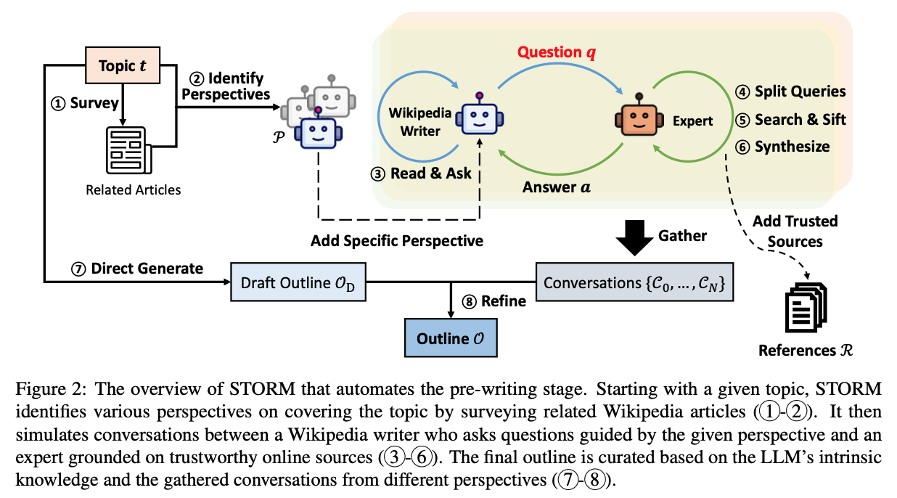

# Literature Agents for Accelerated Knowledge Discovery

This repository contains an implementation of STORM as described in the paper ["STORM"](https://arxiv.org/pdf/2402.14207). The implementation is built using LangGraph and is designed to be flexible, supporting libraries such as **vLLM**, **Ollama**, **IBM RITS**, and **OpenAI**.



## Usage

Follow these steps to use the repository:

### 1. Create a Conda Environment

Create a new Conda environment to manage dependencies:
```bash
conda create -n venv_agents python=3.11.0
conda activate venv_agents
```

### 2. Install Requirements

Install the required packages using pip:
```bash
pip install -r requirements.txt
```

### 3. Set Up Environment Variables

Copy the sample environment file and fill in the necessary API keys and URLs:
```bash
cp .env.sample .env
```
Edit the `.env` file to add your credentials for the tools you plan to use.

### 4. Configure for OpenAI (Optional)

If you plan to use OpenAI, copy the OpenAI-specific tools file to the agent folder. This implementation will be changed in the future.
```bash
cp utils/tools_openai.py .
mv tools.py tools_vllm.py
mv tools_openai.py tools.py
```
### 5. Configure for RITS (Optional)

If you plan to use IBM RITS (only for IBM Research):
```
FAST_LLM/LONG_CTX_LLM: Refer the "Served model name" listed under "Model Information".
OPENAI_API_BASE_FAST_LLM/OPENAI_API_BASE_LONG_CTX_LLM: Refer to the "Model Inference Endpoints" section on the left-hand side. Please append /v1 at the end of the URL
```

## Run the Sample Notebook

There are Jupyter Notebooks available to help you view the outputs of the STORM implementation. 

[STORM Walkthrough](storm_step_by_step.ipynb): Iterate throught the cells to view the output of STORM at each node of the graph.

[STORM](storm.ipynb): View the overall flow of the storm graph from start to finish.

Open the notebook and follow the instructions within to generate outputs and visualizations.

